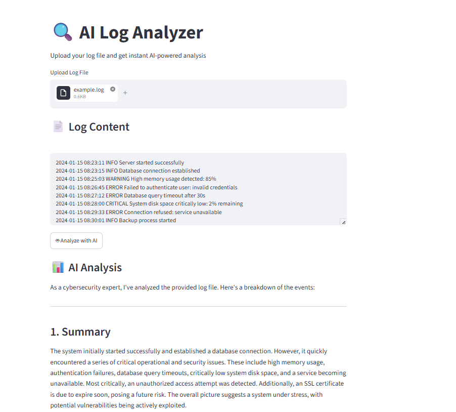

# AI Log Analyzer
An intelligent log analysis tool powered by Google Gemini AI and LangChain.
Automatically detects critical issues, security threats, and provides actionable recommendations.

## Features
- Upload any `.log` or `.txt` file
- AI-powered analysis using Google Gemini
- Detects critical errors, warnings, and security threats
- Provides detailed recommendations

## Tech Stack
- Python
- LangChain
- Google Gemini API
- Streamlit

##  Setup

1. Clone the repository
   git clone https://github.com/leylamammadva/ai-log-analyzer.git

2. Install dependencies
   pip install -r requirements.txt

3. Create .env file and add your API key
   GOOGLE_API_KEY=your_api_key_here

4. Run the app
   streamlit run app.py
## Demo
