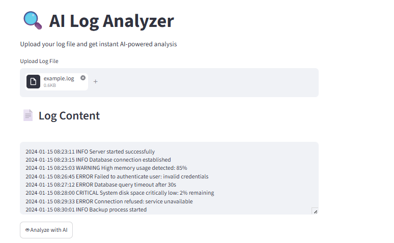
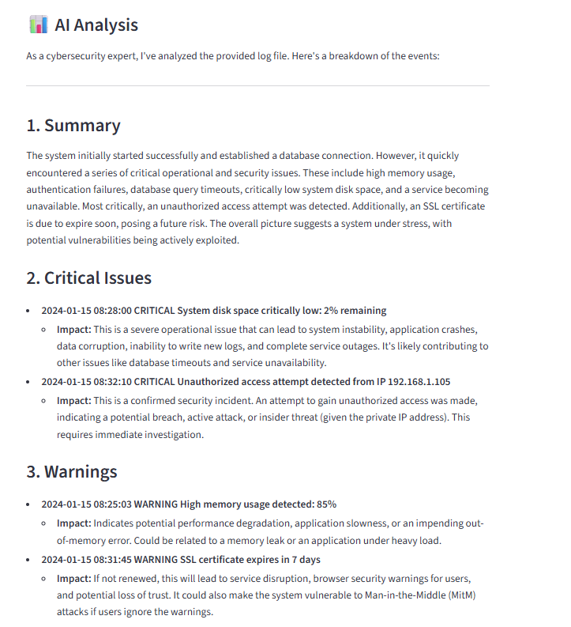
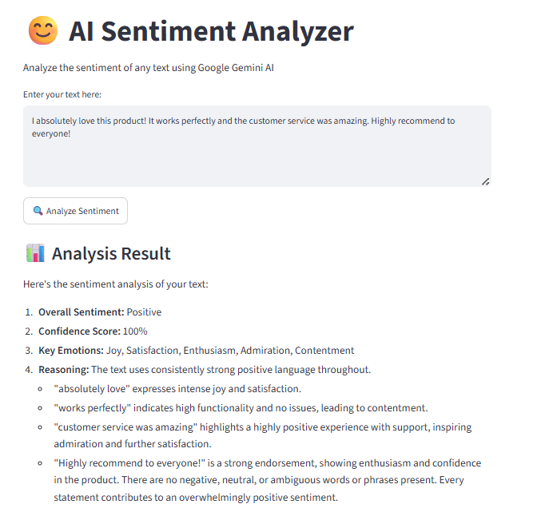

# 🤖 AI Projects

## 🔍 AI Log Analyzer
Intelligent log analysis tool powered by Google Gemini AI and LangChain.
Automatically detects critical issues, security threats, and provides actionable recommendations.

**Tech:** Python, LangChain, Gemini API, Streamlit

### Features
- Upload any `.log` or `.txt` file
- Detects critical errors, warnings, and security threats
- Provides detailed AI-powered recommendations

### Setup
1. Clone the repository
   git clone https://github.com/leylamammadva/ai-log-analyzer.git
2. Install dependencies
   pip install -r requirements.txt
3. Create .env file
   GOOGLE_API_KEY=your_api_key_here
4. Run the app
   streamlit run log-analyzer/app.py

### Demo

---

## 😊 AI Sentiment Analyzer
NLP-based sentiment analysis tool powered by Google Gemini AI.
Analyzes text sentiment and detects key emotions with confidence scoring.

**Tech:** Python, LangChain, Gemini API, Streamlit

### Features
- Analyzes text sentiment (Positive/Negative/Neutral)
- Detects key emotions with confidence score
- Detailed reasoning for each analysis

### Setup
1. Install dependencies
   pip install -r requirements.txt
2. Create .env file
   GOOGLE_API_KEY=your_api_key_here
3. Run the app
   streamlit run sentiment-analyzer/app.py

### Demo
